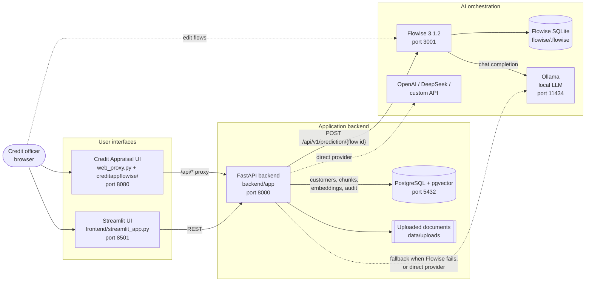
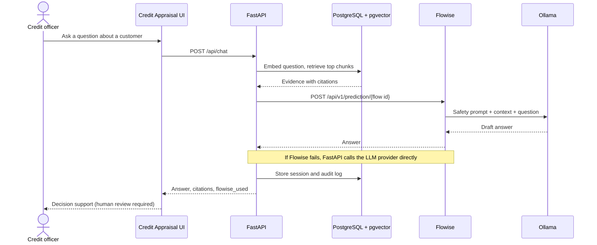

# Credit Appraisal App Architecture

How the pieces started by `./start.sh` fit together.

## Components

## Chat request

## Who owns what

| Component | Owns |
| --- | --- |
| Credit Appraisal UI | Static UI in `creditappflowise/`, served by `web_proxy.py`, which forwards `/api/*` to FastAPI. |
| Streamlit UI | Alternative operator UI talking straight to FastAPI. |
| FastAPI | Document upload, parsing, chunking, embeddings, retrieval, loan policy score, committee submission, final human decision, customer email draft, audit log. |
| PostgreSQL + pgvector | Customers, documents, chunks, embeddings, sessions, decisions, audit. |
| Flowise | Prompt template, model selection and the LLM call for chat answers. |
| Ollama | Local model used by the Flowise backend flow. |

## Flowise flows

`scripts/ensure-flowise-flows.js` adds these when they are missing (run automatically by `start.sh`):

| Flow | ID | Purpose |
| --- | --- | --- |
| Docfactor Credit Appraisal RAG Backend | `6f946e8b-2d35-4fd4-9ff9-158db1f0b820` | Runnable flow: Ollama chat model + banking prompt + LLM chain. FastAPI calls it. |
| Docfactor Full Banking Workflow | `7a1d2c3e-5b4f-4c6d-8e9f-0a1b2c3d4e5f` | 16-stage reference canvas of the whole workflow. Not executable as a prediction. |

## Ports

`start.sh` moves a service to the next free port when its default is taken, and prints the URLs it ended up with.

| Service | Default port | Override |
| --- | --- | --- |
| Credit Appraisal UI | 8080 | `WEB_PORT` |
| FastAPI | 8000 | `BACKEND_PORT` |
| Streamlit | 8501 | `STREAMLIT_PORT` |
| Flowise | 3001 | `FLOWISE_PORT` |
| PostgreSQL (Docker stack) | 5432 | `POSTGRES_HOST_PORT` |
| Ollama | 11434 | `OLLAMA_HOST` |
